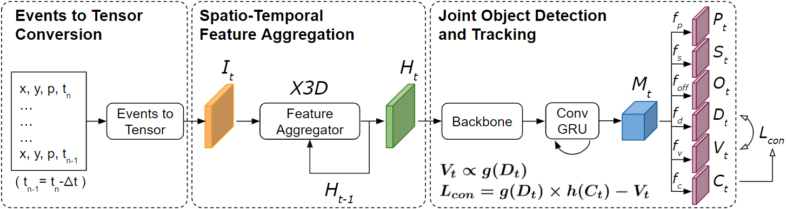

# Tracking-Assisted Object Detection with Event Cameras
This repository contains PyTorch code for the [ECCV NEVI Workshop 2024](https://sites.google.com/view/nevi2024) paper "Tracking-Assisted Object Detection with Event Cameras" [[arXiv](https://arxiv.org/abs/2403.18330)]

    @inproceedings{yen2024tracking,
      title={Tracking-Assisted Object Detection with Event Cameras},
      author={Yen, Ting-Kang and Morawski, Igor and Dangi, Shusil and He, Kai and Lin, Chung-Yi and Yeh, Jia-Fong and Su, Hung-Ting and Hsu, Winston},
      booktitle = {Proceedings of the European Conference on Computer Vision (ECCV) Workshops},
      year={2024}
    }

## Installation

Refer to [INSTALL.md](readme/INSTALL.md) for installation instructions.

## Dataset

Follow the instructions in [DATA.md](readme/DATA.md) to setup the datasets.

## Training and Evaluation

Check [GETTING_STARTED.md](readme/GETTING_STARTED.md) to reproduce the results in the paper. We provide scripts for all the experiments in the [experiments](experiments) folder.

## License

TEDNet is developed upon [PermaTrack](https://github.com/TRI-ML/permatrack). Both codebases are released under MIT License. 

## Acknowledgement
This work was supported in part by National Science and Technology Council, Taiwan, under Grant NSTC 111-2634-F-002-022 and by Qualcomm through a Taiwan University Research Collaboration Project.